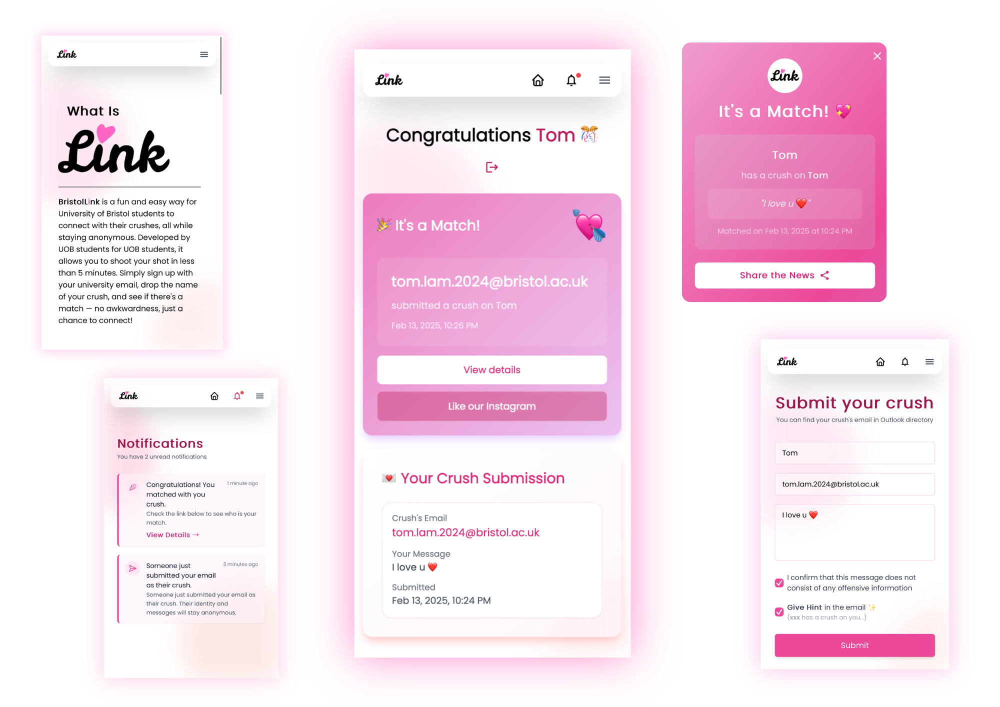

<a href="https://bristollink.uk"></img></a>

<h1 align="center">BristolLink</h1>

A match-making platform for University of Bristol student during Valentine's Day 2025.
 

<a href="https://bristollink.uk/register"></img></a>

 

<b>BristolLink</b> is a fun and easy way for University of Bristol students to connect with their crushes, all while staying anonymous.

Developed by <b>UOB students for UOB students</b>, it allows you to shoot your shot in less than <b>5 minutes</b>.

Simply sign up with your university email, drop the name of your crush, and see if there's a match — <b>no awkwardness, just a chance to connect!</b>

 

<h2 align="center">Enter their Email</h2>

Find their UoB email through Outlook and submit it through Bristol Link. They'll receive an anonymous notification that someone is interested.

<h2 align="center">Wait for their Response</h2>

If they're interested, they'll log into Bristol Link and enter an email address of their own choice.

<h2 align="center">Check for a Match</h2>

If the emails match, you both receive confirmation and can start your story. If not, you'll be notified and can try with someone new.

 

